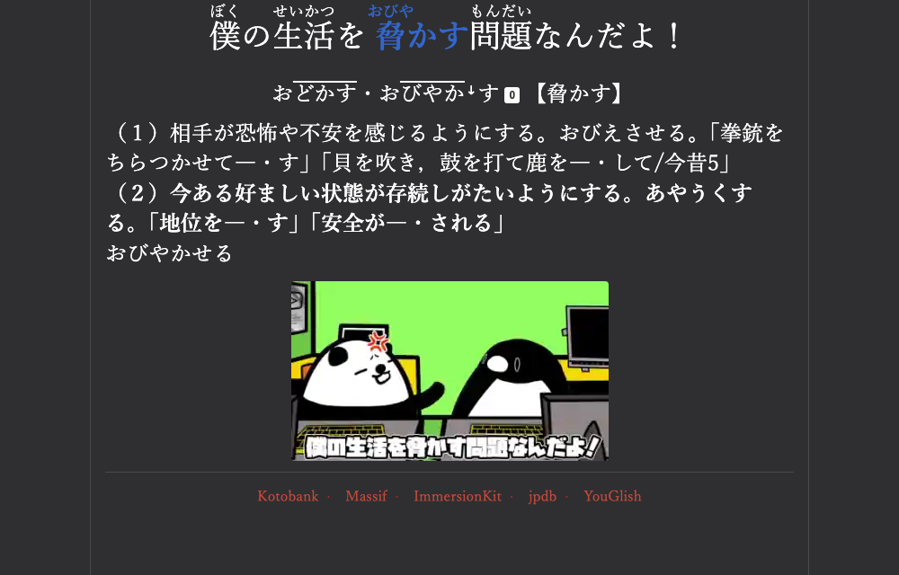

# AJATT — my Japanese immersion setup

Configuration and resources for learning Japanese through immersion: watch native material,
mine sentences out of it into Anki, review daily, repeat.

Everything here is what I actually run, kept reproducible so it's useful to someone else.
Take the parts you want — nothing depends on the rest.

Background: [My journey learning Japanese](https://rotvie.github.io/blog/2025/my-journey-learning-japanese/).

> **Platform:** macOS.

## What's here

**The loop** — get material, immerse, mine, review:

| | |
|---|---|
| [`yt-dlp/`](yt-dlp/) | Download material with Japanese subtitles intact |
| [`mpv/`](mpv/) | Watch it, and mine cards straight out of playback |
| [`anki/`](anki/) | Review — the note type, what makes a good card, formatting reference, and scripts for editing the collection safely |

Each folder has its own README with install paths and what the settings do.

## The loop

```
   watch / read            mine                  review
   ──────────────  ───────────────────────  ──────────────
   mpv + subs      mpvacious → Anki card    daily reps
   yt-dlp                  ↑
                    card-formulation policy
```

1. **Get material** — `yt-dlp` with subtitles, or stream straight into mpv.
2. **Immerse** — watch in mpv. Look words up as you go.
3. **Mine** — when a sentence has exactly *one* unknown word, `Ctrl+E` in
   [mpvacious](https://github.com/Ajatt-Tools/mpvacious) turns it into an Anki card with
   audio, screenshot and context.
4. **Review** — daily, in Anki.




The one non-obvious rule is step 3's **i+1 gate**: a sentence with two or more unknown words
becomes a leech. [`anki/card-formulation/`](anki/card-formulation/) is about why, and what else makes
cards cheap or expensive to review — it's the difference between a collection you keep and
one you abandon.

[`anki/reference/`](anki/reference/) and [`anki/scripts/`](anki/scripts/) are the maintenance
layer: a few thousand mined cards accumulate malformed furigana, stray HTML and half-filled
fields, and fixing that by hand doesn't scale.

## Prerequisites

| Tool | Install | What for |
|---|---|---|
| [mpv](https://mpv.io/) | `brew install mpv` | Watching and mining |
| [yt-dlp](https://github.com/yt-dlp/yt-dlp) | `brew install yt-dlp` | Downloading material |
| [Anki](https://apps.ankiweb.net/) | `brew install --cask anki` | Reviews |
| Python 3 | preinstalled | The note-type installer |

## Quick start

```sh
git clone https://github.com/Rotvie/ajatt
cd ajatt

# ---- mpv ----
sh mpv/install.sh                     # config to ~/.config/mpv, fetches the scripts

# ---- yt-dlp ----
mkdir -p ~/.config/yt-dlp
cp yt-dlp/config.txt ~/.config/yt-dlp/config
$EDITOR ~/.config/yt-dlp/config     # set the -P download path

# ---- Anki ----
# Install the add-ons listed in anki/README.md, restart Anki, leave it running:
python3 anki/note-types/sentence-mining-jp/install.py           # dry run
python3 anki/note-types/sentence-mining-jp/install.py --apply
```

Then install [mpvacious](https://github.com/Ajatt-Tools/mpvacious) in mpv and point it at
the `Sentence Mining JP` note type.

### Check it worked

```sh
mpv --version                                    # mpv sees the config dir
mpv <any video>                                  # uosc UI appears at the bottom
curl -s localhost:8765 -d '{"action":"version","version":6}'   # AnkiConnect answers
```

In Anki, `Tools → Manage Note Types` should list **Sentence Mining JP** with 13 fields and
two card types. Playing a video in mpv and pressing `Ctrl+E` should create a card.

## What is AJATT?

A language-learning approach built on full immersion: surround yourself with Japanese, mine
sentences from what you consume, and review them with spaced repetition. The details are
adaptable; the immersion isn't.

- [Tatsumoto's guide](https://tatsumoto.neocities.org/blog/table-of-contents.html) — the most
  practical modern write-up, and where most of this tooling comes from
- [Refold roadmap](https://refold.la/roadmap) — a structured, stage-by-stage version

## Dictionaries

Monolingual (JP→JP) dictionaries are the goal; JP→EN is the training wheel.

[Dictionaries](https://www.monokakido.jp/en/dictionaries/app/index.html) (macOS / iOS) —
大辞林, 大辞泉, 新明解 and the NHK accent dictionary in one app, searched together.
[qolibri](https://github.com/ludios/qolibri) does the same for EPWING files.

Online: [goo辞書](https://dictionary.goo.ne.jp) and [Jisho](https://jisho.org). For
sentence mining specifically,
[jpdb](https://jpdb.io) (pitch + definitions + examples) and
[Massif](https://massif.la) (real usage) are the two I use most.

## Other tools

- [Textractor](https://github.com/Artikash/Textractor) — pull text out of visual novels
- [subs2cia](https://github.com/dxing97/subs2cia) — condense audio for passive immersion
- [VPNGate](https://www.vpngate.net/en/download.aspx) — reach region-locked Japanese content

## For agents

[`AGENTS.md`](AGENTS.md) is the entry point — what's authoritative, the safe-edit workflow
for the Anki collection, and what's still open. `CLAUDE.md` is a symlink to it. A Claude
Code skill in `.claude/skills/` loads the deck's rules automatically; other harnesses read
`AGENTS.md` and use the same scripts.

## Licence

[MIT](LICENSE).
